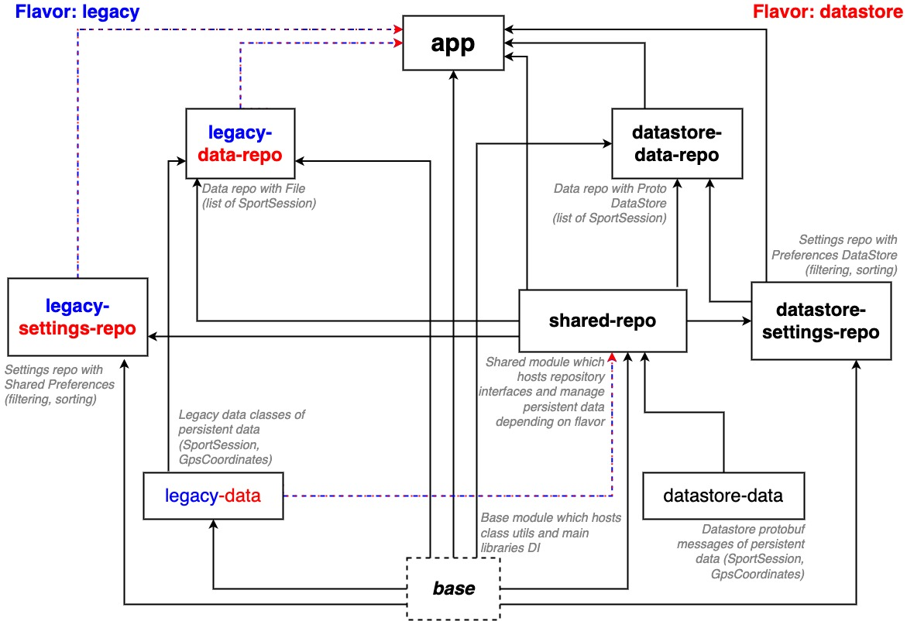
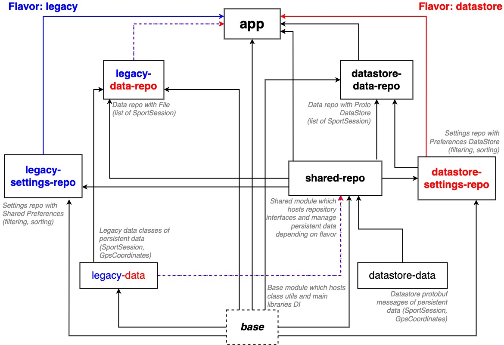
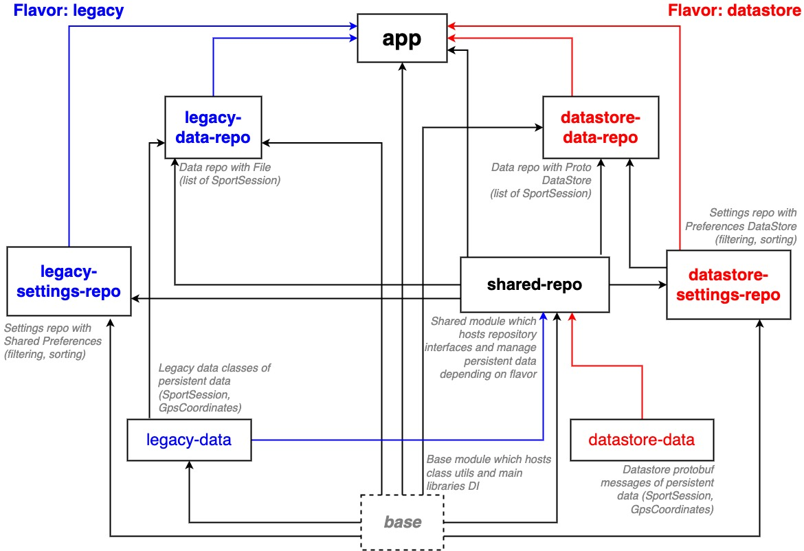

# SFEIR School Android Jetpack DataStore - Training

## Presentation

You will find here the practice section of the SFEIR School Android Jetpack DataStore to apply principles of Preferences and Proto DataStore on a
sample application.

## Application

This application is on a MVVM architecture with Hilt as DI provider (modules is ready to use). The project is divided on several modules :

- ***app***: Hosts the application and UI layer.
- ***base***: Shared module which hosts class utils and main libraries DI.
- ***shared-repo***: Shared module which hosts repository interfaces and manages persistent data models depending on flavor.
- ***legacy-data***: Hosts legacy data classes of persistent data.
- ***legacy-data-repo***: Hosts data repository with File implementation.
- ***legacy-settings-repo***: Hosts settings repository with SharedPreferences implementation.
- ***datastore-data***: Hosts protobuf messages of persistent data.
- ***datastore-data-repo***: Hosts data repository with Proto DataStore implementation.
- ***datastore-settings-repo***: Hosts settings repository with Preferences DataStore implementation.

The application is flavored with 2 variants :

- ***legacy***: This flavor uses SharedPreferences and File as storage solutions.
- ***datastore***: This flavor should use Preferences DataStore and Proto DataStore as new storage solutions.

The goal of this training is to migrate SharedPrefs-Preferences DataStore firstly.
Then, File-Proto DataStore finally.

## GIT branches

### main

Application with Preferences and Proto DataStore implemented (the final solution):

### training/preferences-datastore

Application without both DataStore, the goal of the branch is to implement Preferences DataStore only on the settings layer from SharedPreferences.

There is the start architecture:

After training is done, the architecture should be like:

### training/proto-datastore

Application without Proto DataStore but with Preferences DataStore already implemented on the settings layer, the goal of this branch is to implement
Proto DataStore only on the data layer from File storage solution.

There is the start architecture:

After training is done, the architecture should be like:

